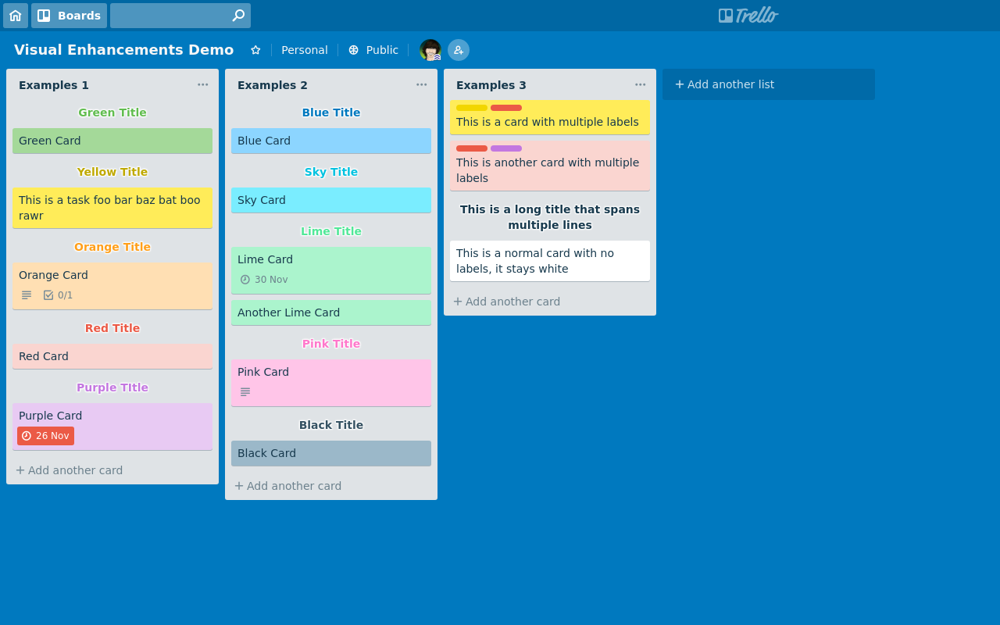

  

# Chrome extension for visual enhancements in Trello

Customize the look of your Trello boards by enabling card background colors (taken from labels) and header cards.

You can try out this extension on the [example board](https://trello.com/b/S3asr5Or/visual-enhancements-demo)

## Instructions

### Headers:

To display headers, add `--` at the start and end of the text for your card.

If this card has a label, then the color of the first label will be used as the
color for the header text

### Background Colors

If this card has a label, then the background color will be based on the color
of the first label. If you only have one label, then that label will be hidden,
otherwise you'll still be able to see all the labels displayed.

## Development TODO:

* More efficient class manipulation of cards to prevent DOM manipulation (manipulate only when necessary)
* Remove use of refreshing Boolean flag and unnecessary `setTimeout` after mutation observer doesn't fire when no changes have been made to card
* Introduce global settings
* Introduce per-board settings
* Activate content script sooner (rather than when idle) so that styles can be applied as soon as cards are displayed.
* Fixup colours a little more (make yellow less intense, maybe green?)
